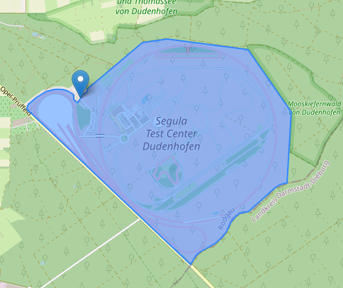
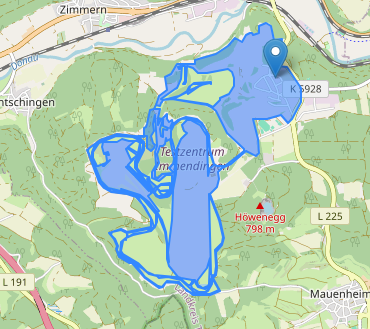

## Motivation 

Suppose we want to calculate an area using OpenStreetMap (OSM) elements you downloaded. Take proving grounds for example.

In OSM provings grounds are often represented as Ways (e.g. Segula Test Center). But it can also be a relation, like the Mercedes proving ground in Immendingen. In this case the relation does not cover the whole premises. So we need a way to calculate the are from the `relation`.

## Challenge

There is not a unique way to get from a bunch of points to a convex hull.

https://alastaira.wordpress.com/2011/03/22/alpha-shapes-and-concave-hulls/ has a good illustration of the problem.

## Resources

- https://en.wikipedia.org/wiki/Alpha_shape
- Defintions: https://doc.cgal.org/latest/Alpha_shapes_2/index.html#title0
- GeoPandas method: https://geopandas.org/en/latest/docs/reference/api/geopandas.GeoSeries.concave_hull.html
- Documentation of the algorithm: https://libgeos.org/doxygen/classgeos_1_1algorithm_1_1hull_1_1ConcaveHull.html
- Python package: https://alphashape.readthedocs.io

