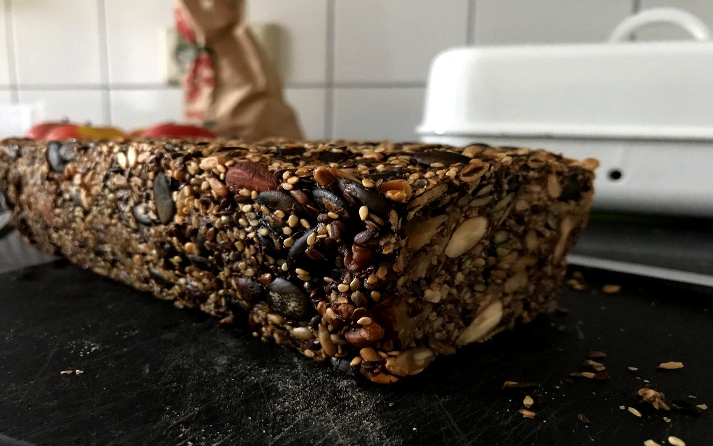

<p>I recently stumbled upon this
<a href="https://greenysherry.com/life-changing-brot-mit-nuessen-nach-my-new-roots-glutenfrei-vegan/">bread recipe</a>.
It’s quickly prepared, the bread tastes great and is full of valuable ingredients
(only oats, nuts and seeds).
However, being homemade it does not come with a nutrition table.
The following shows an easy way to create one.</p>

<!-- more -->

<p>We put the recipe into a spreadsheet
(<a href="https://docs.google.com/spreadsheets/d/1C0AwjQYrudrV3ZLgQJZnCr9La7OVftRTZn3QKMrJx5E">recipe</a>).
Another spreadsheet contains the nutritional values of the macro nutrients of each ingredient
(<a href="https://docs.google.com/spreadsheets/d/1qgo8Yefb5nx5PVElZvmf6nSDI6RfN2ofd8CeMuSklHk">food stats</a>).
We combine these using <strong>R</strong> to get the nutrition table.
Then, we look at an alternative to manually creating a spreadsheet with nutritional information
by using an online database.
As a bonus, we can calculate the price of the recipe.</p>
<div id="downloading-google-sheets-to-r" class="section level2">
<h2>Downloading Google Sheets to R</h2>
<p>A simple way to import Google Sheets to <strong>R</strong> is the
<a href="https://cran.r-project.org/package=gsheet">gsheet</a> package.
We only need to supply the sharing link.
It returns a <a href="https://tibble.tidyverse.org/">tibble</a>.</p>

```r-stats
food_stats = gsheet::gsheet2tbl(https://docs.google.com/spreadsheets/d/1qgo8Yefb5nx5PVElZvmf6nSDI6RfN2ofd8CeMuSklHk)

recipe = gsheet::gsheet2tbl(https://docs.google.com/spreadsheets/d/1C0AwjQYrudrV3ZLgQJZnCr9La7OVftRTZn3QKMrJx5E)
```

<p><code>food_stats</code> contains more ingredients than we need for our bread recipe.
So when we merge both data frames we only want to keep the rows
that contain the ingredients of the recipe.
This is done by <code>left_join()</code> from the
<a href="https://cran.r-project.org/package=dplyr">dplyr</a> package.</p>

```
library(dplyr)
bread_ingredient_stats = left_join(recipe, food_stats, "Description")
```

</div>
<div id="calculating-the-nutritional-values" class="section level2">
<h2>Calculating the nutritional values</h2>
<p>We have 10 ingredients. First, we create a vector that gives us
the quantity of each ingredient in grams,
then we select the columns that are relevant for the nutrition table.</p>
<pre class="r"><code>nutrient_names = c(&quot;Calories (kcal)&quot;, &quot;Total Fat&quot;, &quot;Saturated Fat&quot;,
  &quot;Total Carbs&quot;, &quot;Sugar&quot;, &quot;Dietary Fiber&quot;, &quot;Protein&quot;)
quantities = select(bread_ingredient_stats, &quot;Quantity (gr)&quot;)[[1]]
nutrition_values = bread_ingredient_stats %&gt;% select(nutrient_names)</code></pre>
<p>The following calculation gives us the quantity of
each macro nutrient in our bread <em>per 100g</em>:</p>
<pre class="r"><code>nutrition_table = colSums(nutrition_values * quantities) / sum(quantities)</code></pre>
<p>Finally, we can print our nutrition table:</p>
<pre class="r"><code>knitr::kable(nutrition_table, digits = 1, col.names = &quot;per 100g&quot;,
  caption = &quot;Nutrition table&quot;)</code></pre>
<table>
<caption><span id="tab:unnamed-chunk-5">Table 1: </span>Nutrition table</caption>
<thead>
<tr class="header">
<th></th>
<th align="right">per 100g</th>
</tr>
</thead>
<tbody>
<tr class="odd">
<td>Calories (kcal)</td>
<td align="right">307.3</td>
</tr>
<tr class="even">
<td>Total Fat</td>
<td align="right">22.5</td>
</tr>
<tr class="odd">
<td>Saturated Fat</td>
<td align="right">4.7</td>
</tr>
<tr class="even">
<td>Total Carbs</td>
<td align="right">12.2</td>
</tr>
<tr class="odd">
<td>Sugar</td>
<td align="right">0.5</td>
</tr>
<tr class="even">
<td>Dietary Fiber</td>
<td align="right">10.6</td>
</tr>
<tr class="odd">
<td>Protein</td>
<td align="right">12.6</td>
</tr>
</tbody>
</table>
<p>Calorie-wise very similar to your <a href="https://www.google.com/search?q=brown+bread">typical brown bread</a>, but rich in fat.
Trust me, the bread is very filling, so you won’t be able to eat too much of it anyways.
And how much does it cost?</p>
<pre class="r"><code>prices = select(bread_ingredient_stats, &quot;Price (€)&quot;)[[1]]
packaging = select(bread_ingredient_stats, &quot;Packaging (g)&quot;)[[1]]
(price_total = sum(prices / packaging * quantities, na.rm = TRUE))</code></pre>
<pre><code>## [1] 3.208962</code></pre>
<p>One loaf of bread is 3.21€ (not including energy and time)
weighing 910 grams (raw ingredients).
I think that is a fair price for a bread I can eat from for a whole week.</p>
</div>
<div id="using-the-api-of-a-nutrition-database" class="section level2">
<h2>Using the API of a nutrition database</h2>
<p>Instead of manually creating a spreadsheet for the nutritional values of each ingredient
we can fetch the information from on online database.
We use <a href="https://openfoodfacts.org">openfoodfacts</a>.
It’s a crowd-sourced database of food stats.
To identify a product we need a barcode for each ingredient
which I added to the recipe spreadsheet.
The openfoodfacts API returns a JSON file which we can convert to a list
using the <a href="https://cran.r-project.org/package=rjson">rjson</a> package.
We write two helper functions to fetch and extract the relevant information.</p>
<pre class="r"><code>library(&quot;rjson&quot;)
fetch_json = function(barcode, url = &quot;https://world.openfoodfacts.org/api/v0/product/&quot;) {
  query = paste0(url, barcode, &quot;.json&quot;)
  fromJSON(file = query)
}

extract_nutrition_values = function(food_list,
  nutriments = c(&quot;energy_100g&quot;, &quot;fat_100g&quot;, &quot;saturated-fat_100g&quot;,
  &quot;carbohydrates_100g&quot;, &quot;sugars_100g&quot;, &quot;fiber_100g&quot;,
  &quot;proteins_100g&quot;)) {
  nv = setNames(rep(0, length(nutriments)), nutriments)
  tmp = unlist(food_list$product$nutriments[nutriments])
  nv[names(tmp)] = tmp
  nv
}

barcodes = bread_ingredient_stats$Barcode[-10] # water does not have a barcode
nutrition_values_api = matrix(0, nrow = 10, ncol = length(nutrition_values),
  dimnames = list(1:10, nutrient_names))
for(i in seq_along(barcodes)) {
  food_list_tmp = fetch_json(barcodes[i])
  nutrition_values_api[i,] = extract_nutrition_values(food_list_tmp)
}</code></pre>
<p><code>nutrition_values_api</code> has the same structure as <code>nutrition_values</code> from above,
so we can proceed as before:</p>
<pre class="r"><code>(nutrition_table_api = colSums(nutrition_values_api * quantities) / sum(quantities))</code></pre>
<pre><code>## Calories (kcal)       Total Fat   Saturated Fat     Total Carbs
##    1344.0329670      22.4906593       4.7263736      12.3516484
##           Sugar   Dietary Fiber         Protein
##       0.4923077       8.9291209      12.5313187</code></pre>
<p>The results for the macro nutrients differ slightly which is expected
because we changed the data source.
However, the value for <em>calories</em> quadrupled
because the API reported energy in kilojoule (kJ) instead of kilocalories.
To correct for this we divide the value by <span class="math inline">\(4.1858\)</span>.</p>
<pre class="r"><code>nutrition_table_api[1] = nutrition_table_api[1] / 4.1858
knitr::kable(nutrition_table_api, digits = 1, col.names = &quot;per 100g&quot;,
  caption = &quot;Nutrition table&quot;)</code></pre>
<table>
<caption><span id="tab:unnamed-chunk-9">Table 2: </span>Nutrition table</caption>
<thead>
<tr class="header">
<th></th>
<th align="right">per 100g</th>
</tr>
</thead>
<tbody>
<tr class="odd">
<td>Calories (kcal)</td>
<td align="right">321.1</td>
</tr>
<tr class="even">
<td>Total Fat</td>
<td align="right">22.5</td>
</tr>
<tr class="odd">
<td>Saturated Fat</td>
<td align="right">4.7</td>
</tr>
<tr class="even">
<td>Total Carbs</td>
<td align="right">12.4</td>
</tr>
<tr class="odd">
<td>Sugar</td>
<td align="right">0.5</td>
</tr>
<tr class="even">
<td>Dietary Fiber</td>
<td align="right">8.9</td>
</tr>
<tr class="odd">
<td>Protein</td>
<td align="right">12.5</td>
</tr>
</tbody>
</table>
<p>And we are done!</p>
</div>
